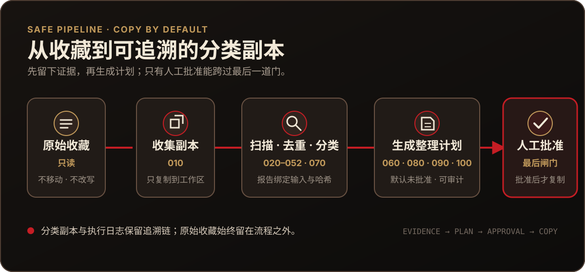

# 酒馆角色卡分类与标签整理

想找同人、校园、都市、纯爱或其他题材的角色卡，不必再逐张打开查看。这个项目会先读懂角色卡内容，把它们放进更好找的分类中；整理完成后，再把分类写进角色卡标签，方便你在 SillyTavern 里继续筛选。

> [!IMPORTANT]
> 这个项目只做了两件事：分类，打标签。

## 角色卡会怎样被整理

1. **先定好分类标准**：先判断需要避开的内容，再从常见题材中选择最符合的一类；同人卡还会继续判断原作或系列。
2. **让模型分批识别**：通过 API 一批读取 30 张角色卡。遇到返回不完整或格式异常时，只把尚未识别的卡片拆成更小批次重新判断，直到得到结果或转交人工复核。
3. **完成一级分类**：每张卡只进入一个最主要的类别；明确命中避雷标准的单独放置，无法确定的留给人工确认。
4. **把同人卡再分一次**：同人角色卡按作品或系列做二级分类，再把同名变体和零散目录按 IP 归并，得到更容易浏览的分类副本。
5. **按最终位置写标签**：保留角色卡原有标签，并追加一级分类；同人卡还会追加最终确认的 IP 名称。

## 现在已经整理到哪一步

截至 **2026-09-11**，流程已经完成扫描、一级分类、同人二级分类、IP 归并和分类标签写入。

| 从扫描到整理 | 已得到的结果 |
|---|---|
| 扫描原始工作副本 | 找到 **15,795** 个文件，识别出 **15,134** 张有效角色卡 |
| 一级分类 | **12,754** 张进入常见分类，**2,075** 张进入避雷目录，**305** 张留待人工确认 |
| 同人二级分类与 IP 归并 | **2,250** 张同人角色卡整理为 **36** 个直属 IP 目录 |
| 完整性检查 | **15,134 / 15,134** 张全部复制成功，整理前后没有缺卡或内容差异 |
| 分类标签 | **15,134** 张已全部生成带标签副本；其中 **15,133** 张写入了新标签，1 张无需新增标签而原样复制，共新增 **17,150** 个标签 |

完整批次记录、分类质量风险和下一步进度见 [当前状态](./docs/status.md)。

## 它怎样保护你的收藏

<p align="center">
  
</p>

- **来源只读**：收集阶段只复制，不移动、删除或改写原始收藏。
- **证据先行**：扫描、去重和分类写入独立报告，不直接操作角色卡。
- **批准后写入**：整理阶段先生成计划；只有匹配同一计划哈希的批准文件才能执行。
- **默认复制**：整理默认使用复制；第六阶段的 `move` 必须单独批准且不得作用于原始收藏，二次整理和 IP 归并只允许复制；已有目标不会被静默覆盖。
- **模型调用可见**：真实分类会把裁剪字段发送到配置的外部服务，必须单独授权。

同名不等于重复。同名但内容不同的卡片会按不同版本保留。

## 快速开始

先确认工作树，再运行不会处理真实收藏、也不会调用外部模型的测试：

```powershell
git status --short
node --test
```

当前自动化测试共 **34 项，全部通过**。这些测试只使用临时目录和本地模拟服务，不会处理真实收藏或调用外部模型。

需要实际操作时，从 [运行手册](./docs/runbook.md) 复制命令，并先阅读相邻的风险说明。第一次了解整体流程，建议先看 [系统架构与数据流](./docs/architecture.md)。

## 仓库地图

```text
角色卡分类/
├─ src/                    # 收集、扫描、分类与整理脚本
├─ test/                   # 不接触真实收藏的自动化测试
├─ docs/                   # 状态、架构、运行手册与历史快照
├─ data/                   # 本地工作数据；不纳入 Git
├─ reports/                # 批次证据与执行日志；不纳入 Git
├─ 分类标准.md             # 分类规则的唯一权威来源
└─ CONTEXT.md              # 领域术语表
```

`SillyInnkeeper-main/` 只用于格式兼容研究，不是运行依赖，也不属于本项目的修改范围。

## 继续阅读

- [当前状态](./docs/status.md)：权威批次、哈希、完成情况与阻塞条件
- [系统架构与数据流](./docs/architecture.md)：各阶段职责和输入输出关系
- [运行手册](./docs/runbook.md)：经过核实的命令、参数和副作用警告
- [分类政策入口](./docs/classification-policy.md)：如何使用唯一权威规则
- [领域词汇表](./CONTEXT.md)：文件记录、唯一内容、批次等术语
- [历史快照](./docs/history/)：保留当时日期、数量、哈希与结论的不可变记录
- [文档索引](./docs/README.md)：全部文档入口
