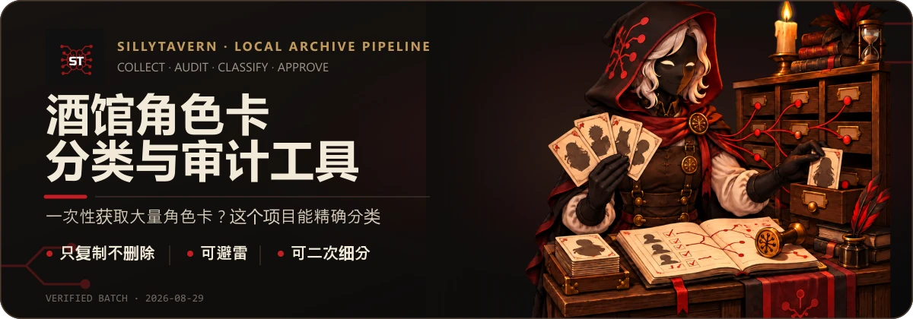

# 酒馆角色卡分类与标签整理

[English](./README.md)

<p align="center">
  
</p>

## 项目用途

这是一个 Windows 优先、可审计的 SillyTavern（酒馆）角色卡收集、扫描、分类、整理与标签写入流水线。它只在本地工作副本上处理角色卡，把卡片整理到更容易浏览的分类中，并把分类标签写入新的副本，方便继续在 SillyTavern 中筛选。

## 安全边界

- **原始收藏只读。** 收集阶段只复制人工选定的文件，不移动、删除或改写原始收藏。
- **先留证据，再操作文件。** 扫描、去重和模型分类写入独立报告；整理和标签写入先生成计划，执行同一份计划前还必须完成批准。
- **默认复制。** 已存在的目标不会被静默覆盖。第六阶段的 `move` 需要单独批准且不得作用于原始收藏；后续整理阶段只允许复制。
- **外部模型调用明确可见。** 分类只会向配置的服务发送裁剪后的角色卡字段，运行前必须单独授权。不要把 API 密钥写进仓库、脚本或报告。
- **不同内容都会保留。** 同名但内容不同的角色卡会作为不同版本分别保存。

## 当前状态

截至 **2026-09-14**，已验证完成扫描、一级分类、同人卡细分、IP 归并和分类标签写入：

- 扫描到 **15,795** 个文件，建立了 **15,134** 条有效角色卡记录。
- 一级分类包含 **12,754** 张常见分类卡、**2,075** 张排除卡，以及 **305** 张待人工复核卡。
- **15,134** 张卡都已有整理副本；其中 **15,133** 张生成了带新标签的副本，**1** 张原样复制，共新增 **17,150** 个标签。
- 剩余工作是人工质量抽检；当前 070 v2 源码能力尚没有完成的权威外部模型批次。

完整批次元数据、哈希、完成记录、风险和下一步见[当前状态](./docs/status.zh-CN.md)。

## 快速开始

环境要求：Windows、PowerShell 7，以及 Node.js 22 或更高版本。

```powershell
git clone https://github.com/Jason084/sillytavern-card-classifier.git
Set-Location .\sillytavern-card-classifier
npm ci
git status --short
npm run check
```

`npm run check` 会依次执行语法检查、自动化测试、Markdown 链接检查、公开内容检查和分类政策译文检查。这些检查只使用临时目录和本地测试数据，不会处理真实收藏，也不会调用外部模型。

需要实际处理收藏时，请从[运行手册](./docs/runbook.zh-CN.md)复制命令，并先阅读相邻的风险说明。在理解输入、输出和批准要求前，不要运行收集、分类、整理或模型命令。

## 文档导航

- [当前状态](./docs/status.zh-CN.md)：权威批次、哈希、完成情况、风险与阻塞条件
- [系统架构与数据流](./docs/architecture.zh-CN.md)：各阶段职责和输入输出关系
- [运行手册](./docs/runbook.zh-CN.md)：经过核实的命令、参数和副作用警告
- [分类政策入口](./docs/classification-policy.zh-CN.md)：代码如何使用唯一权威分类政策
- [分类标准](./分类标准.md)：唯一权威的分类规则
- [领域词汇表](./CONTEXT.zh-CN.md)：项目术语说明
- [文档索引](./docs/README.md)：全部项目文档
- [贡献指南](./CONTRIBUTING.zh-CN.md) · [安全政策](./SECURITY.zh-CN.md) · [MIT 许可证](./LICENSE)
